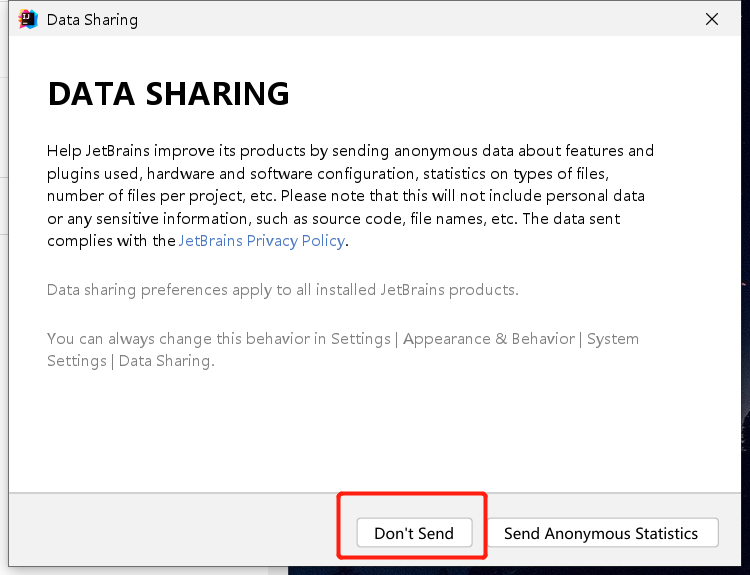
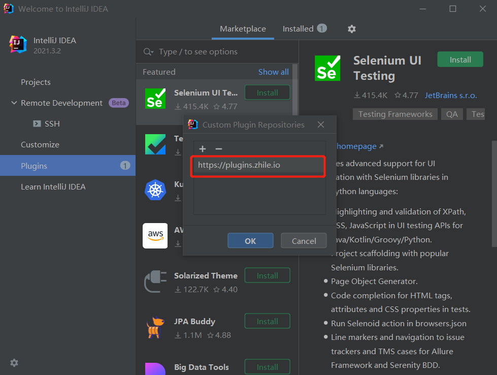

## IDEA的安装（安装包在官网下载即可）

### 步骤①：点击“Next”

### 步骤②：修改安装路径然后“Next”下一步

### 步骤③：这边笔者全部都不选

Create Desktop Shortcut：创建桌面快捷方式

Update PATH Variable(restart needed)：更新PATH变量(需要重新启动)

> Add "bin" folder to the PATH：将“bin”文件夹添加到PATH

Update Context Menu：更新右键菜单

> Add "Open Folder as Project"：添加“将文件夹作为项目打开”

Create Associations：创建关联（勾选后，双击对应文件就会用它打开）

### 步骤④：点击"Install"

### 步骤⑤：点击"Finish"即可安装完成

### 步骤⑥：安装IDE Eval Reset插件--无限重置30天试用

1、打开安装好的IDEA，勾选后点击"Continue"

2、这貌似一个是否数据共享的选项，笔者这里选择不发送

3、进入这个界面之后我们点击登录

4、待它自动跳转到官网让你登录，没有账号可以自行注册

5、登录成功后返回软件，选择"Strat trial"开始试用

Send me tips to learn IntelliJ IDEA faster：向我发送提示以更快地学习 IntelliJ IDEA

Tell me about new product features as they come out：告诉我有关新产品功能的信息

6、点击"Start Trial"

7、Subscription is active until May 19,2022：订阅有效期至 2022 年 5 月 19 日

点击"Close"关闭

8、这个界面点击"Plugins"打开插件商店

9、点击设置，选择第一个"Manage Plugin Repositories"

10、输入"https://plugins.zhile.io"

11、在搜索栏搜索"IDE"即可找到"IDE Eval Reset"插件，点击"Install"然后点击"Accept"

12、安装完成后重启软件，接着点击设置、点击"Eval Reset"

13、Logout when reset：重置时注销

Auto reset before per restart：每次重启前自动重置

